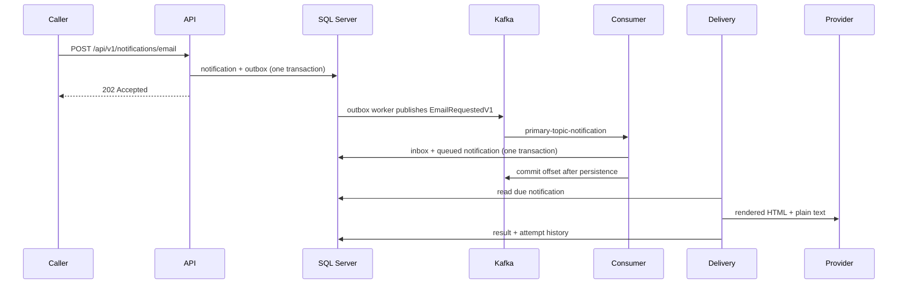
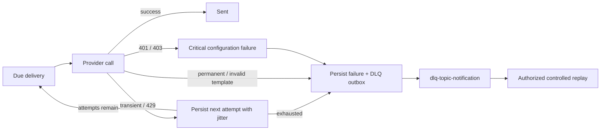

# MPDCApiTemplate

An ASP.NET Core 10 Web API template built on Clean Architecture, with CQRS (MediatR), JWT authentication,
EF Core / SQL Server persistence, and OpenTelemetry-based observability wired in out of the box.

## Email notification service

The repository now includes a production-oriented, email-only notification pipeline. Its channel-neutral application
boundaries (`IEmailProvider`, renderer, Kafka publisher, and persistence store) allow SMS, push, or WhatsApp adapters to
be added without changing the email workflow. The API and workers remain in the existing single host; registrations are
modular so workers can be split into another executable later.





### Request and status API

All notification operations use the existing JWT authentication fallback policy. Replay additionally requires the
`RequireAdmin` policy. Writes are limited to 60 requests per minute per authenticated identity/IP and request bodies to
64 KiB.

```bash
curl -i -X POST https://localhost:5001/api/v1/notifications/email \
  -H "Authorization: Bearer $ACCESS_TOKEN" -H "Content-Type: application/json" \
  -d '{"idempotencyKey":"payment-123-confirmation","correlationId":"payment-123","recipient":{"email":"customer@example.com","name":"Customer Name"},"templateId":"payment-confirmed","templateVersion":1,"variables":{"customerName":"Customer Name","paymentReference":"PAY-123"},"subject":null,"priority":"Normal","scheduledAt":null}'

curl -H "Authorization: Bearer $ACCESS_TOKEN" \
  https://localhost:5001/api/v1/notifications/NOTIFICATION_ID

curl -X POST -H "Authorization: Bearer $ADMIN_TOKEN" \
  https://localhost:5001/api/v1/notifications/NOTIFICATION_ID/replay
```

The POST returns `202 Accepted`, a `Location` header, and `notificationId`, `messageId`, and current `status`. Reusing an
idempotency key returns that original notification. Status includes safe failure fields and attempt summaries; provider
exceptions, credentials, message bodies, and template variables are never returned.

### Reliability model

- REST acceptance commits the notification and `EmailRequestedV1` outbox row atomically. The single outbox worker reads
  and publishes one due row at a time with Kafka `acks=all` and idempotent production, then acknowledges it and
  immediately checks for the next row.
- Direct Kafka input converges on the same notification/delivery tables. `notification-service-email-v1` disables auto
  commit/store and commits only after a unique inbox row and delivery state are durable. Invalid/unsupported contracts
  are safely described and sent to the DLQ through an outbox row.
- The single delivery worker sequentially reads and delivers one due notification at a time, immediately continuing
  while work exists and waiting for the polling interval only when idle. The
  default schedule is immediate, approximately 1, 5, and 15 minutes,
  then 1 hour, with ±20% jitter. Timeouts, network errors, 408, 429, and 5xx are transient. Invalid content and recipients
  are permanent. Provider 401/403 responses are configuration failures and are not aggressively retried.
- Permanent/exhausted failures atomically create a DLQ outbox record and retain attempt history. The service deliberately
  does not consume the DLQ. Admin replay appends a `NotificationReplays` audit row and schedules a validated new attempt.
- Delivery is at least once. There is an unavoidable crash window after a provider accepts a message but before local
  success is committed. `MessageId` is supplied as the provider idempotency key where supported; without provider-side
  idempotency, exactly-once email delivery cannot be guaranteed.

Production initially runs exactly one notification-service replica, with one outbox publisher, Kafka consumer, email
delivery worker, and outbox cleanup worker. A crash before publication leaves the outbox row pending, and a crash before
provider delivery leaves the notification queued. A crash after Kafka accepts an event but before local completion can
publish a duplicate Kafka event; a crash after the email provider accepts a message but before `Sent` is saved can send a
duplicate email. Kafka deduplication and provider idempotency remain responsible for these at-least-once boundaries.

An application publishing directly to Kafka must use an outbox in its own database when publication is coupled to its
business transaction. This service cannot make another application's database mutation atomic with Kafka publication.

### Kafka prerequisites

Kafka is external and is intentionally absent from `compose.yaml`. Provision these existing topics:

| Topic | Partitions | Replication | Min ISR | Cleanup | Retention | Max message |
|---|---:|---:|---:|---|---:|---:|
| `primary-topic-notification` | 6 | 3 | 2 | delete | 3 days | 1,048,576 bytes |
| `dlq-topic-notification` | 3 | 3 | 2 | delete | 30 days | 1,048,576 bytes |

Topic and group names are configuration, not code constants. JSON contracts carry `ContractVersion`; `MessageId` is the
Kafka key, while correlation, causation, and schema version are headers. Kafka payloads contain no attachments or binary
content.

### Notification configuration

Safe defaults are in `Api/appsettings.json`. Production should override values using environment variables or the
deployment secret store, for example `Kafka__BootstrapServers`, `EmailProvider__Provider=Brevo`,
`EmailProvider__ApiKey`, and `EmailProvider__DefaultSenderEmail`. No real credential belongs in appsettings or source.
Brevo uses one `IHttpClientFactory` client with a configured timeout; `Fake` is the local/test provider. Sender and
template allow-lists prevent open-relay behavior, subject overrides are disabled by default, and file templates are
versioned under `Api/Templates/<template-id>/v<version>`. Identifiers are strictly checked against path traversal,
required variables are validated, and HTML substitutions are encoded.

Important option sections are `Kafka`, `Outbox`, `EmailDelivery`, `EmailProvider`, and `EmailTemplates`. Options use
startup validation. Apply the schema and run with:

```bash
dotnet restore MPDCApiTemplate.sln
dotnet ef database update --project Persistence --startup-project Api
dotnet run --project Api
```

Health endpoints are `/health/live` (process only) and `/health/ready` (SQL Server, Kafka, and email configuration).
Serilog fields and OpenTelemetry spans/metrics cover notification/message/correlation IDs, Kafka coordinates, provider,
attempt, outcome, and duration without logging recipients or content. Metrics include request/sent/failure/retry/DLQ
counters, provider duration, Kafka lag, and pending/oldest-age gauges for outbox and delivery work.

## Architecture

The solution is split into five projects, each with a single direction of dependency (outer layers depend on
inner ones, never the reverse):

| Project | Responsibility |
|---|---|
| `Domain` | Entities, domain events, and domain exceptions. No dependencies on anything else in the solution. |
| `Application` | Use cases as MediatR commands/queries + handlers, one folder per feature under `Features/`, FluentValidation validators, AutoMapper projections, and the pipeline behaviours (logging, performance, validation, unhandled-exception) that wrap every request. Depends only on `Domain`. |
| `Infrastructure` | Implementations of the interfaces `Application` declares — JWT issuing, password hashing, the current-user accessor — plus cross-cutting extensions for auth, CORS, Serilog, and OpenTelemetry. |
| `Persistence` | `ApplicationDbContext` (EF Core / SQL Server), entity configurations, and migrations. Implements `Application`'s `IApplicationDbContext`. |
| `Api` | ASP.NET Core host: controllers, the global exception handler, OpenAPI/Swagger setup. Composes the other four layers via DI in `Program.cs`. |

Adding a new use case means adding a new folder under `Application/Features/<FeatureName>/{Commands,Queries}/<Name>/`
— see [FeatureCli](#featurecli-scaffolding-tool) below for a scaffolding tool that generates this structure for you.

## Tech stack

- **ASP.NET Core 10** / EF Core 10 targeting SQL Server
- **MediatR** for CQRS, **FluentValidation** for request validation, **AutoMapper** for query projections
- **JWT bearer auth** (`Microsoft.AspNetCore.Authentication.JwtBearer`) with **BCrypt.Net-Next** password hashing
- **Serilog** (console/file/MSSQL/Grafana Loki sinks) + **OpenTelemetry** (traces, metrics, logs via OTLP, with ASP.NET Core / HttpClient / SqlClient / Hangfire / EF Core instrumentation)
- **xUnit** for testing, with a custom OpenTelemetry test-result exporter (see [Testing](#testing))

## Using this repo as a `dotnet new` template

This repo ships a `.template.config/template.json`, so instead of cloning it and hand-renaming everything,
you can install it as a `dotnet new` template and scaffold fresh, ready-to-build solutions from the CLI.

### Install

```bash
dotnet new install /path/to/this/repo
# or, from inside the repo:
dotnet new install .
```

This registers it as **Clean Architecture Web API** under the short name **`cleanapi`**. Confirm it's there with:

```bash
dotnet new list cleanapi
```

### Scaffold a new solution

```bash
dotnet new cleanapi -n YourCompany.YourProject \
  --DefaultDbInstance "localhost,1433" \
  --LoggingDbInstance "localhost,1433"
```

| Parameter | Required | Description |
|---|---|---|
| `-n, --name <Name>` | yes | Solution/root-namespace name. Also becomes the output folder (`YourCompany.YourProject/`) and the default database name in both connection strings |
| `--DefaultDbInstance <addr>` | yes | SQL Server instance for the `Default` connection string, e.g. `localhost,1433` |
| `--LoggingDbInstance <addr>` | yes | SQL Server instance for the Serilog MSSQL sink's `Logging` connection string |

This renames every occurrence of `MPDCApiTemplate` — namespaces, the `.sln` file, the default database name,
even inside this README — to whatever you pass as `-n`, fills in the two connection-string placeholders, and
swaps in fresh project GUIDs. Verified end-to-end: a solution scaffolded this way builds clean with `dotnet build`,
zero errors.

**Not included in a generated solution:** `tools/FeatureCli` and `nuget-local-feed/` are deliberately excluded
from the template (see the `exclude` list in `.template.config/template.json`) — they're tooling for developing
*this* repo, not part of the shipped API. A scaffolded project's copy of this README will still describe
FeatureCli even though the tool itself isn't there; if you want it in a new project too, copy `tools/FeatureCli`
over by hand and follow [Installing FeatureCli as a global tool](#installing-featurecli-as-a-global-tool).

### Uninstall

```bash
dotnet new uninstall /path/to/this/repo
```

## Getting started

### Prerequisites

- .NET 10 SDK
- A SQL Server instance reachable at the connection string in `Api/appsettings*.json` (defaults to `localhost,14330`)
- Optionally, an OTLP-compatible collector (Jaeger, Aspire Dashboard, the OTel Collector, etc.) at the endpoint configured under `OpenTelemetry:Otlp:Endpoint`

### Configuration

Configuration lives in `Api/appsettings.json` and `Api/appsettings.Development.json`:

- `ConnectionStrings:Default` / `:Logging` — SQL Server connection strings (app data and the Serilog MSSQL sink)
- `Jwt:SigningKey` / `:Issuer` / `:Audience` / `:AccessTokenExpirationMinutes` — token issuing config. The shipped dev key is for local use only; set a real secret (e.g. via user-secrets or environment variables) for anything beyond local development
- `OpenTelemetry:ServiceName` / `:Otlp:Endpoint` — where traces/metrics/logs are exported
- `Cors:AllowedOrigins` — allowed origins for the API's CORS policy

### Running the API

```bash
dotnet run --project Api
```

In `Development`, the API uses a local SQLite database (`mpdca-development.db`) and creates its schema on first
startup, so SQL Server is not required for day-to-day development. Delete that ignored file whenever you want a clean
local database. Kafka remains enabled in Development and expects the brokers configured under `Kafka:BootstrapServers`
to be running. Production continues to default to SQL Server and Kafka and uses the migrations in `Persistence/Migrations`.

When Rider runs the API through `compose.yaml`, the API listens on host port `8080` and joins the external
`kafka_default` Docker network. It reaches Kafka through the brokers' internal addresses (`kafka-1:9092`,
`kafka-2:9092`, and `kafka-3:9092`), not through `localhost`. Start the separate Kafka Compose project first so
that network exists.

To exercise SQL Server while developing, override the provider and connection string:

```bash
Database__Provider=SqlServer \
ConnectionStrings__Default='Server=localhost,1433;Database=MPDCApiTemplate;User Id=sa;Password=...;TrustServerCertificate=True' \
dotnet run --project Api
```

By default the API serves Swagger UI at `/swagger` (backed by the OpenAPI document at `/openapi/v1.json`).
A `diagnostics/throw-exception` endpoint is included to exercise the global exception handler.

### Postman API tests

Import `postman/MPDCApiTemplate.postman_collection.json` and
`postman/MPDCApiTemplate.Docker.postman_environment.json`, select the **MPDCApiTemplate - Rider Docker** environment,
and run the collection in order. It creates a unique user, captures its JWT and notification ID, then exercises health,
authentication, notification/idempotency, authorization, validation, and diagnostics scenarios. The environment targets
`http://localhost:8080`; change `baseUrl` to `http://localhost:5290` when running the API directly instead of through Rider/Docker.

Admin replay requires an existing Admin user: set `adminUsername` and the secret `adminPassword` environment variable
before running that request. Replay also requires a notification in `PermanentlyFailed` or `DeadLettered` state.

### Database migrations

EF Core migrations live in `Persistence/Migrations`. With the `dotnet-ef` global tool installed:

```bash
dotnet ef database update --project Persistence --startup-project Api
```

### Docker

Each layer has a `Dockerfile`, and `compose.yaml` at the repo root builds an image per project:

```bash
docker compose build
```

This builds the application images only — it does not provision SQL Server or an OTLP collector, which
you're expected to run separately (or add your own services to the compose file for local orchestration).

## Testing

The `Tests/` folder contains one project per layer that has meaningful logic to verify:

| Project | Covers |
|---|---|
| `Domain.UnitTests` | Entity base classes (domain events, audit defaults), exception message formatting |
| `Infrastructure.UnitTests` | `DateTimeService`, `BCryptPasswordHasher`, `JwtTokenGenerator`, `CurrentUserService` |
| `Persistence.UnitTests` | `ApplicationDbContext` audit-field stamping and CRUD, against EF Core InMemory |
| `Application.UnitTests` | CQRS convention checks, handler behaviour (against EF Core InMemory), validators, pipeline behaviours |
| `Api.IntegrationTests` | End-to-end auth flow against an in-process `WebApplicationFactory<Program>` |

Run everything with:

```bash
dotnet test MPDCApiTemplate.sln
```

### Exporting test results to OpenTelemetry

`tools/TestTelemetryExporter` reads a `.trx` results file and re-emits it as OpenTelemetry signals — one span
per test (name, outcome, duration, error status on failure) plus pass/fail/skip counters — to either an OTLP
collector or the console, so a test run can show up next to your app's traces in the same observability backend:

```bash
dotnet test --logger "trx;LogFileName=results.trx"
dotnet run --project tools/TestTelemetryExporter -- <path-to-results.trx> [--otlp-endpoint http://localhost:4317] [--service-name MyService]
```

Omitting `--otlp-endpoint` uses the console exporter. The tool exits non-zero if any test failed, so it can
also be used as a CI gate.

## FeatureCli scaffolding tool

`tools/FeatureCli` is a console tool (`PackageId: FeatureCli`, command name `feature`) that scaffolds new CQRS
features under `<ProjectDir>/Features/<FeatureFolder>/<Queries|Commands>/<Name>/`. It has three subcommands:
`query` and `command` scaffold a single request (as a TODO-marked stub for you to fill in), and `crud` scaffolds
a full working Create/Read/Update/Delete set for one entity in one shot.

### `query` / `command` — single request

```bash
feature query   --feature Products --entity Product --name GetProductById
```

generates:

```
Application/Features/Products/Queries/GetProductById/
├── GetBookByIdQuery.cs         # public record GetBookByIdQuery : IRequest<GetBookByIdResponse>;
├── GetBookByIdQueryHandler.cs  # handler stub, throws NotImplementedException with a TODO
└── GetBookByIdResponse.cs      # empty response DTO, TODO to fill in properties
```

```bash
feature command --feature Products --entity Product --name DeleteProduct
```

generates the command equivalent — `DeleteBookCommand.cs`, `DeleteBookCommandHandler.cs`, and
`DeleteBookCommandValidator.cs` — each with a `// TODO` marking the part you still need to write.

### `crud` — a full CRUD slice for one entity

The intended workflow is **entity-first**: add the entity class under `Domain/Entities` yourself (it has to
exist for `context.<Plural>` to compile anyway), then let `crud` read its properties straight off that file —
no need to type them out again:

```bash
# Domain/Entities/Category.cs already defines Title (string) and Description (string?)
feature crud --feature Categories --entity Category --plural Categories
```
```
Detected 2 properties from 'Domain/Entities/Category.cs': Title:string, Description:string?
Created Application/Features/Categories/Commands/CreateCategory/CreateCategoryCommand.cs
...
```

`crud` finds `<EntityName>.cs` by searching the `Domain` project (override with `--entity-project` or point at
it directly with `--entity-path`), then picks up every `public ... { get; set; }` / `{ get; init; }` property
whose type is a plain scalar (`string`, `int`, `bool`, `DateTimeOffset`, `Guid`, etc.). Navigation properties
and collections (anything not in that scalar list) are skipped automatically — no risk of trying to scaffold a
command parameter typed as another entity. If no entity file is found, or it has no scalar properties yet,
`crud` falls back to a single `Title:string` and tells you so.

Pass `--properties "Name:Type,..."` explicitly to skip auto-detection entirely — useful if the entity doesn't
exist yet, or you want the generated slice to differ from the entity's actual shape:

```bash
feature crud --feature Categories --entity Category --properties "Title:string,Description:string?"
```

Either way you get five complete, working (not stubbed) features plus a controller in one call:

```
Application/Features/Categories/
├── Commands/
│   ├── CreateCategory/    CreateCategoryCommand.cs, CreateCategoryCommandHandler.cs, CreateCategoryCommandValidator.cs
│   ├── UpdateCategory/    UpdateCategoryCommand.cs, UpdateCategoryCommandHandler.cs, UpdateCategoryCommandValidator.cs
│   └── DeleteCategory/    DeleteCategoryCommand.cs, DeleteCategoryCommandHandler.cs
└── Queries/
    ├── GetCategoryById/   GetCategoryByIdQuery.cs, GetCategoryByIdQueryHandler.cs
    └── GetCategories/     GetCategoriesQuery.cs, GetCategoriesQueryHandler.cs, CategoryDto.cs

Api/Controllers/
└── CategoriesController.cs   GET/GET-by-id/POST/PUT/DELETE wired to the commands/queries above
```

Each handler is fully implemented against `context.Categories` (add/save, `FirstOrDefaultAsync` + `NotFoundException`,
AutoMapper `ProjectTo`), and `CategoryDto` is generated once under `GetCategories/` and shared by both queries —
`CategoriesController` (found by searching for `<ApiProject>.csproj`, default `Api`) follows the template's
`BaseController`/`Mediator` pattern — no constructor injection, just `[HttpGet]`/`[HttpPost]`/etc. methods that call
`this.Mediator.Send(...)`. Pass `--no-controller` to skip it. The only other thing left to you is registering
`Category` on `IApplicationDbContext`/`ApplicationDbContext` and adding an EF configuration/migration.

By default `crud` naively pluralizes the entity name by appending `s` (`Category` → `Categorys`) — pass
`--plural Categories` to fix irregular plurals, as in the examples above.

### Options

| Option | Applies to | Description |
|---|---|---|
| `-f, --feature <FeatureFolder>` | all | Feature folder name, e.g. `Products` (required) |
| `-e, --entity <EntityName>` | all | Entity the feature operates on (required) |
| `-n, --name <QueryName\|CommandName>` | `query`, `command` | Name of the query/command, e.g. `GetBookById` (required) |
| `--properties <spec>` | `crud` | Comma-separated `Name:Type` pairs for the entity, e.g. `"Title:string,Notes:string?"`. Omit to auto-detect from the entity's own class file instead |
| `--entity-project <Name>` | `crud` | Project to search for `<EntityName>.cs` when auto-detecting (default: `Domain`) |
| `--entity-path <path>` | `crud` | Explicit path to the entity's `.cs` file, skips entity-file discovery |
| `--plural <Name>` | `crud` | DbSet/query name for the entity (default: `<EntityName>s`) |
| `--key-type <Type>` | `crud` | Type of the entity's `Id` (default: `int`) |
| `-p, --project <Name>` | all | `.csproj` to scaffold into, matched by file name (default: `Application`) |
| `--project-path <path>` | all | Explicit path to the target `.csproj`, skips project discovery |
| `--dbcontext <TypeName>` | all | DbContext interface type used by the handler (default: `IApplicationDbContext`) |
| `--dbcontext-namespace <ns>` | all | Namespace of that interface (default: `<RootNamespace>.Common.Interfaces`) |
| `--api-project <Name>` | `crud` | `.csproj` to generate the controller into, matched by file name (default: `Api`) |
| `--api-project-path <path>` | `crud` | Explicit path to the target API `.csproj`, skips project discovery |
| `--no-controller` | `crud` | Skip generating the `{Plural}Controller.cs` |
| `--force` | all | Overwrite the target folder(s)/controller file if they already exist |

Run `dotnet run --project tools/FeatureCli -- --help` (or `feature --help` once installed) for the same
reference at any time.

### Installing FeatureCli as a global tool

FeatureCli isn't published to nuget.org — it's packed and installed from a local package feed
(`nuget-local-feed/`, git-ignored, at the repo root).

**1. Pack it:**

```bash
dotnet pack tools/FeatureCli/FeatureCli.csproj -c Release -o nuget-local-feed
```

**2. Install it globally:**

```bash
dotnet tool install --global --add-source nuget-local-feed FeatureCli
```

This puts a `feature` command on your `PATH` (via `~/.dotnet/tools`), usable from any directory. Verify with:

```bash
feature --help
```

**Updating** after a change to `tools/FeatureCli` — bump `<Version>` in `FeatureCli.csproj`, then:

```bash
dotnet pack tools/FeatureCli/FeatureCli.csproj -c Release -o nuget-local-feed
dotnet tool update --global --add-source nuget-local-feed FeatureCli
```

**Uninstalling:**

```bash
dotnet tool uninstall --global FeatureCli
```

If you'd rather not touch global tools, install it as a **local tool** instead, scoped to a
`.config/dotnet-tools.json` manifest in this repo:

```bash
dotnet new tool-manifest   # only if the repo has no manifest yet
dotnet tool install --add-source nuget-local-feed FeatureCli
dotnet feature --help      # local tools are invoked via `dotnet <command>`
```
